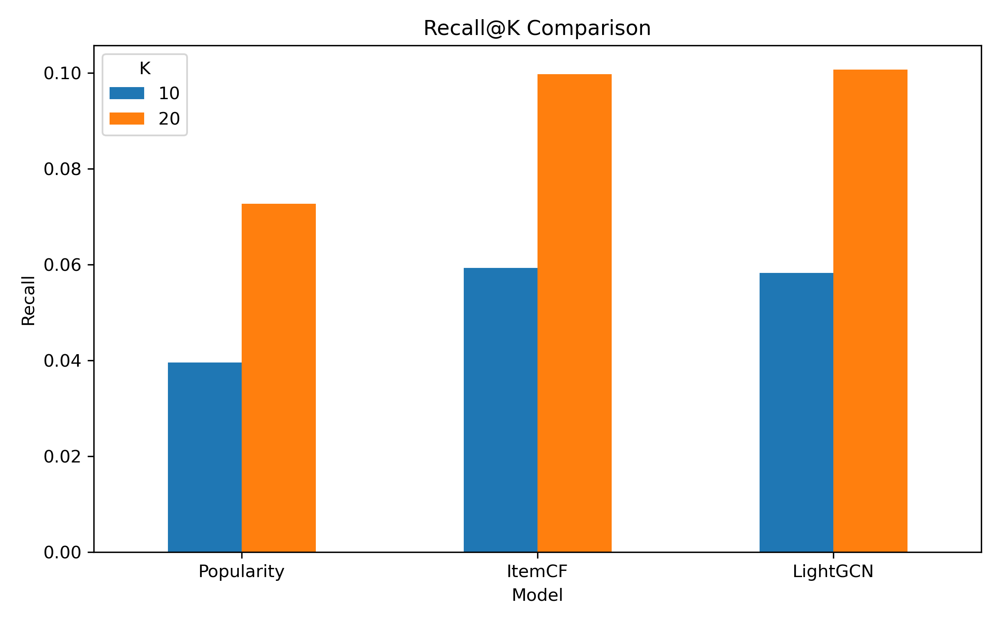
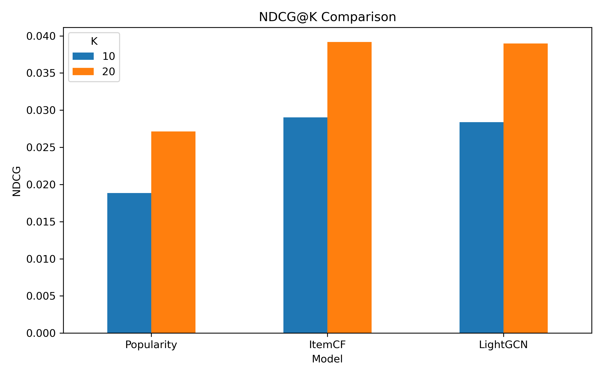
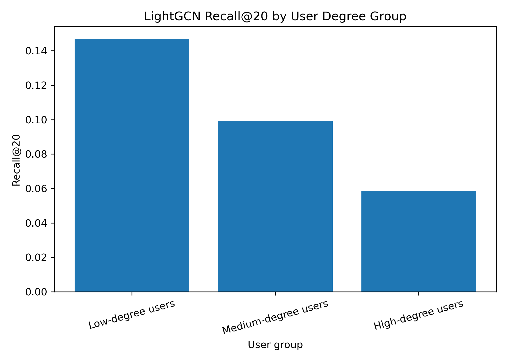
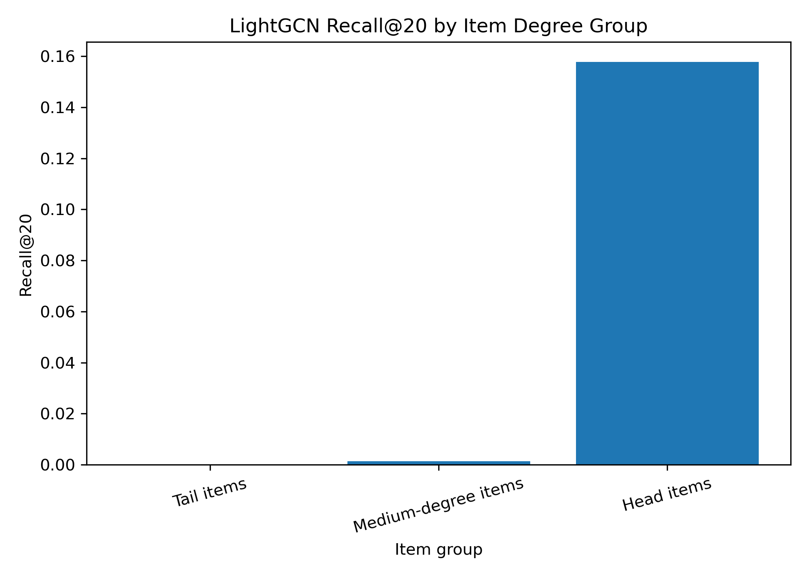
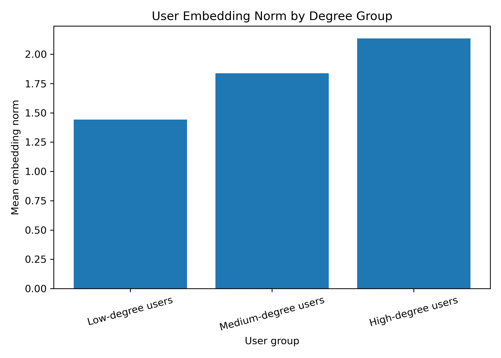
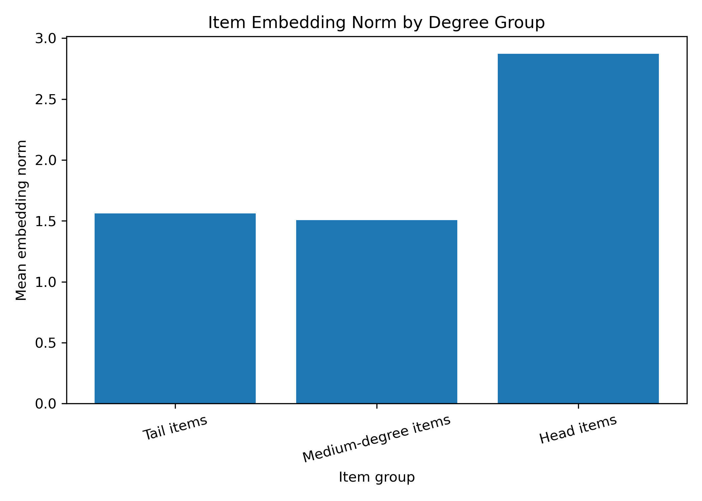
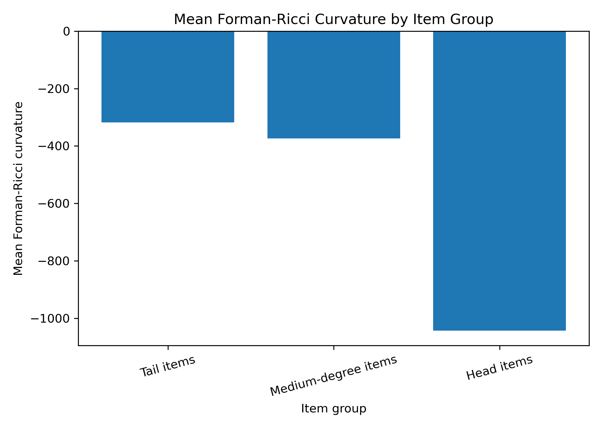
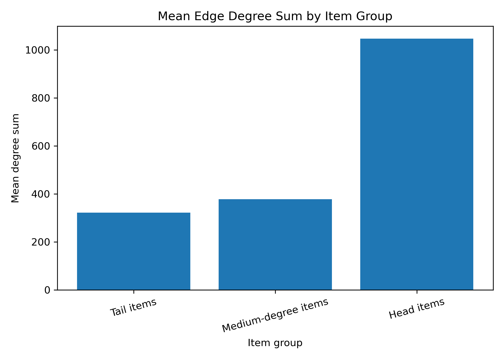

# Revised Structural Focus

**Change:** Ollivier-Ricci curvature → Forman-Ricci curvature

For each user-item edge \(e = (u, i)\):

| Quantity | Formula | Meaning |
|---|---|---|
| Degree sum | \(deg(u) + deg(i)\) | high-degree vs low-degree endpoints |
| Degree difference | \(\lvert deg(u) - deg(i) \rvert\) | imbalance between endpoints |
| Forman-Ricci curvature | \(F(e) = 4 - [deg(u) + deg(i)]\) | degree-sum-based curvature descriptor |

**Key relation:**  
In this setting: larger degree sum → lower Forman-Ricci curvature

**Purpose:**  
Use these edge-level quantities to describe local degree-based structure before analysing LightGCN behaviour.

# Preliminary Analysis Results

## 1. Implementation Progress

| Step | Status | Output |
|---|---|---|
| MovieLens-1M preprocessing | Completed | `interactions.csv` |
| Temporal train/val/test split | Completed | `train.csv`, `val.csv`, `test.csv` |
| Graph structure analysis | Completed | `graph_stats.csv` |
| Degree-based grouping | Completed | `user_degrees.csv`, `item_degrees.csv` |
| Popularity baseline | Completed | `popularity_metrics.csv` |
| ItemCF baseline | Completed | `itemcf_metrics.csv` |
| LightGCN | Completed | `lightgcn_metrics.csv`, embeddings |

---

## 2. Dataset Processing

| Item | Result |
|---|---:|
| Dataset | MovieLens-1M |
| Raw ratings | 1,000,209 |
| Positive threshold | rating >= 4 |
| Positive interactions | 575,281 |
| Users | 6,038 |
| Items | 3,533 |

**Processing idea:** explicit ratings → implicit positive interactions

---

## 3. Temporal Split

| Split | Number of interactions |
|---|---:|
| Train | 563,206 |
| Validation | 6,035 |
| Test | 6,035 |

**Split strategy:**  
For each user: earlier interactions → train, second last → validation, last → test

---

## 4. Training Graph Statistics

| Graph property | Value |
|---|---:|
| Users | 6,035 |
| Items | 3,525 |
| Edges | 563,206 |
| Density | 0.0265 |
| Sparsity | 0.9735 |

**Preliminary observation:** the user-item graph is sparse.

---

## 5. Degree Distribution

### User Degree

| Statistic | Value |
|---|---:|
| Min | 2 |
| Median | 56 |
| Mean | 93.32 |
| Max | 1,433 |

### Item Degree

| Statistic | Value |
|---|---:|
| Min | 1 |
| Median | 48 |
| Mean | 159.77 |
| Max | 2,805 |

**Preliminary observation:** both users and items show clear degree heterogeneity.

---

## 6. Degree-based Groups

### User Groups

| Group | Count |
|---|---:|
| Low-degree users | 1,212 |
| Medium-degree users | 3,612 |
| High-degree users | 1,211 |

### Item Groups

| Group | Count |
|---|---:|
| Low-degree / tail items | 737 |
| Medium-degree items | 2,081 |
| High-degree / head items | 707 |

**Purpose:** use these groups for later grouped evaluation.

---

## 7. Popularity Baseline

| Model | Recall@10 | NDCG@10 | Recall@20 | NDCG@20 |
|---|---:|---:|---:|---:|
| Popularity | 0.0396 | 0.0189 | 0.0727 | 0.0271 |

**Role:** simple non-personalized reference point before ItemCF and LightGCN.

---

## 8. ItemCF Baseline

| Model | Recall@10 | NDCG@10 | Recall@20 | NDCG@20 |
|---|---:|---:|---:|---:|
| ItemCF | 0.0593 | 0.0290 | 0.0998 | 0.0392 |

**Observation:**  
ItemCF performs better than the popularity baseline on all metrics.

**Role:**  
Personalized collaborative filtering baseline before LightGCN.

## 9. LightGCN Initial Result

| Model | Recall@10 | NDCG@10 | Recall@20 | NDCG@20 |
|---|---:|---:|---:|---:|
| LightGCN | 0.0583 | 0.0284 | 0.1007 | 0.0390 |

**Observation:**  
LightGCN performs similarly to ItemCF in the initial setting. It has the highest Recall@20, while ItemCF is slightly better on Recall@10 and NDCG.

**Role:**  
LightGCN is used as the main graph-based model for later grouped evaluation and embedding analysis.

## 10. Model Comparison Figures

**Observation:**  
Popularity is the weakest baseline. ItemCF and LightGCN both improve over Popularity. In the initial setting, LightGCN and ItemCF perform similarly, with LightGCN slightly higher on Recall@20.

## 11. LightGCN Grouped Evaluation

### User Degree Groups

| Group | Recall@10 | NDCG@10 | Recall@20 | NDCG@20 |
|---|---:|---:|---:|---:|
| Low-degree users | 0.0883 | 0.0461 | 0.1469 | 0.0609 |
| Medium-degree users | 0.0565 | 0.0264 | 0.0994 | 0.0371 |
| High-degree users | 0.0339 | 0.0165 | 0.0586 | 0.0227 |

**Observation:**  
LightGCN performance differs across user degree groups. In this initial result, low-degree users obtain higher Recall/NDCG than medium- and high-degree users.

### Item Degree Groups

| Group | Recall@10 | NDCG@10 | Recall@20 | NDCG@20 |
|---|---:|---:|---:|---:|
| Tail items | 0.0000 | 0.0000 | 0.0000 | 0.0000 |
| Medium-degree items | 0.0005 | 0.0002 | 0.0014 | 0.0004 |
| Head items | 0.0915 | 0.0446 | 0.1577 | 0.0611 |

**Observation:**  
LightGCN mainly performs well on high-degree/head items, while performance on tail items is almost zero in this initial setting.

**Interpretation:**  
Overall metrics hide strong group-level differences, especially the item-side head-tail gap.

## 12. Test Item Composition Check

| User group | Head test items | Medium test items | Tail test items |
|---|---:|---:|---:|
| Low-degree users | 70.6% | 28.2% | 1.2% |
| Medium-degree users | 65.8% | 32.8% | 1.3% |
| High-degree users | 49.9% | 47.6% | 2.4% |

**Observation:**  
Low-degree users have the highest proportion of head items in their test interactions.

**Interpretation:**  
The higher Recall@20 for low-degree users may be partly explained by their test items being more popularity-oriented. This suggests that user-side grouped performance should be interpreted together with item-side composition, rather than interpreted only as better representation quality for low-degree users.

## 13. Embedding Norm Analysis

### User Embedding Norm by Degree Group

| User group | Mean embedding norm |
|---|---:|
| Low-degree users | 1.44 |
| Medium-degree users | 1.84 |
| High-degree users | 2.13 |

### Item Embedding Norm by Degree Group

| Item group | Mean embedding norm |
|---|---:|
| Tail items | 1.56 |
| Medium-degree items | 1.51 |
| Head items | 2.87 |

### Degree-Embedding Norm Correlation

| Node type | Correlation |
|---|---:|
| User | 0.585 |
| Item | 0.843 |

**Observation:**  
Embedding norm increases with degree, especially on the item side.

**Interpretation:**  
The learned LightGCN embeddings reflect the degree structure of the user-item graph. Head items have much larger embedding norms than medium- and low-degree items, which is consistent with the stronger recommendation performance on head items.

## 14. Forman-Ricci Curvature Analysis

### Edge Structure by Item Group

| Item group | Mean degree sum | Mean degree difference | Mean Forman-Ricci curvature |
|---|---:|---:|---:|
| Tail items | 322.05 | 310.13 | -318.05 |
| Medium-degree items | 377.85 | 178.10 | -373.85 |
| Head items | 1047.09 | 682.77 | -1043.09 |

**Observation:**  
Edges connected to head items have the largest mean degree sum and the most negative mean Forman-Ricci curvature.

**Interpretation:**  
The Forman-Ricci curvature used in this project is defined as \(F(e)=4-d_u-d_i\). Therefore, more negative curvature corresponds to edges whose endpoints have larger total degree. The results show that head-item regions of the graph are characterised by much more negative curvature than medium- or tail-item regions. This provides an edge-level curvature description of the same structural imbalance observed in grouped recommendation performance and embedding norm analysis.

## 15. Next Steps

| Step | Goal |

|---|---|

| Finish report writing | Complete Results, Discussion, Endmatter, and references |

| Add citations | Add references for LightGCN, MovieLens, collaborative filtering, evaluation metrics, and Forman-Ricci curvature |

| Check robustness if time allows | Test whether the findings are stable under different degree thresholds or LightGCN settings |

| Final LaTeX cleanup | Check figure paths, captions, labels, page limit, and template requirements |

